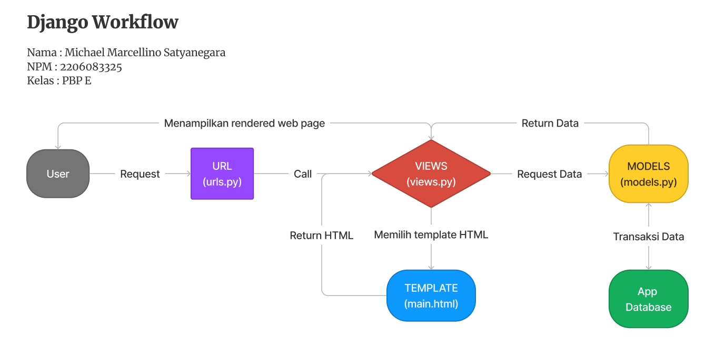
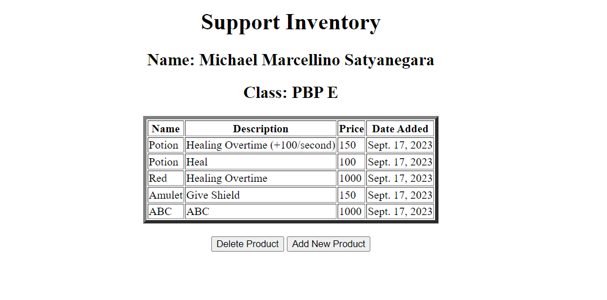
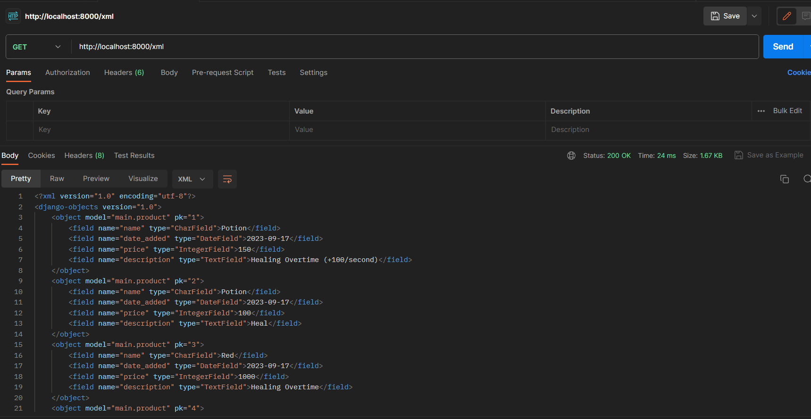
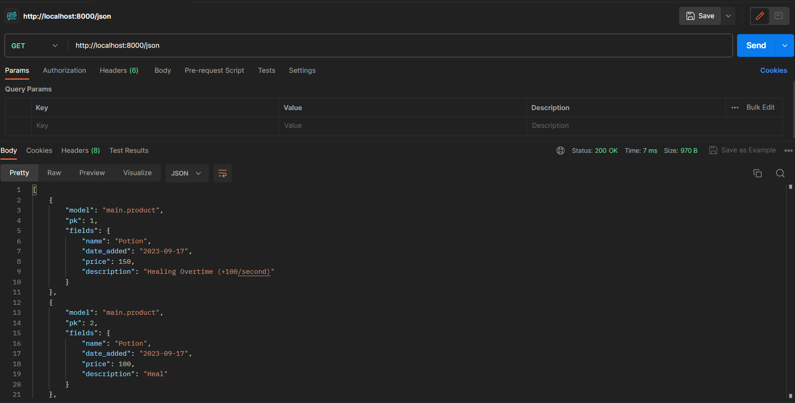
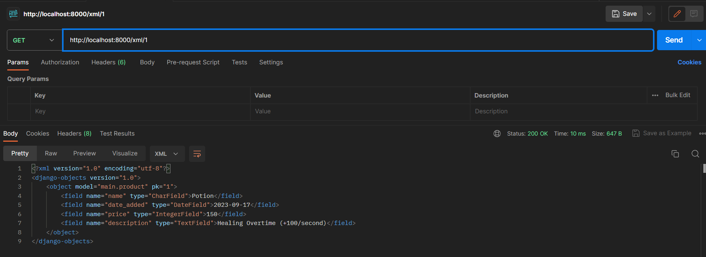
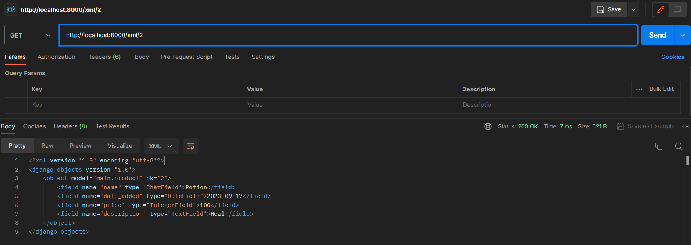
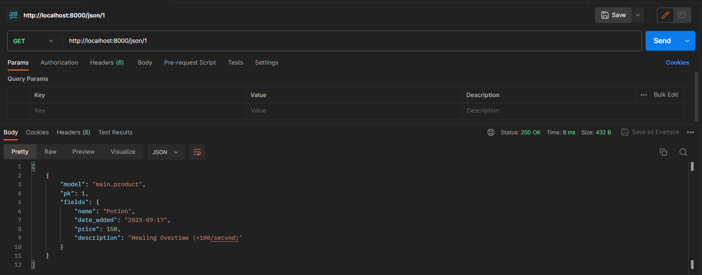

Nama        : Michael Marcellino Satyanegara

NPM         : 2206083325

Kelas       : PBP E

Adaptable   : [Support Inventory](https://support.adaptable.app/main/)

[Tugas 2](#tugas-2)

[Tugas 3](#tugas-3)

[Tugas 4](#tugas-4)

[Tugas 5](#tugas-5)

# Tugas 2

## Checklist Tugas

*Checklist* untuk tugas ini adalah sebagai berikut.

### A. Jelaskan bagaimana cara kamu mengimplementasikan *checklist* di atas secara *step-by-step*.
#### 1. Membuat sebuah proyek Django baru.
1. Pastikan bahwa kita sudah *download* aplikasi Django terlebih dahulu. Kalian bisa melakukan *download* pada link berikut [Django](https://www.djangoproject.com/).
2. Buatlah direktori utama (folder utama) yang akan kita gunakan untuk membuat sebuah proyek Django baru.
3. Kita buka *command prompt* untuk Windows atau *terminal shell* untuk Unix pada direktori utama tersebut.
4. Pada *command prompt* atau *terminal shell*, buatlah *virtual environment* dengan menjalankan sebuah perintah.
    ```
    python -m venv env
    ```
    Penggunaan virtual enviroment ini bertujuan melakukan isolasi pada aplikasi yang dibuat agar tidak terjadi tabrakan/gangguan terhadap versi lain yang ada pada komputer kita.
5. Setelah kita buat *virtual environment*, sekarang kita aktifkan *virtual environment* tersebut dengan perintah.

    ```
    env\Scripts\activate.bat -> (Untuk Windows)

                        Atau
    
    source env/bin/activate -> (Untuk Mac/Linux)
    ```
    Kita dapat mengetahui *Virtual environment* aktif, saat baris input pada terminal kita ditandai dengan (env).
6. Buatlah *file* baru dengan nama `requirements.txt` pada direktori utama dan tambahkan beberapa *dependencies* ke dalam *file* tersebut.
    ```
    django
    gunicorn
    whitenoise
    psycopg2-binary
    requests
    urllib3
    ```
7. Setelah membuat file, sekarang kita *install file* `requirements.txt` yang berisi beberapa *dependencies* dengan perintah.
    ```
    pip install -r requirements.txt
    ```
8. Setelah install berhasil, sekarang kita buat proyek Django baru dengan perintah.
    ```
    django-admin startproject {Nama App} .
    ```
    Keterangan : {Nama App} itu bebas sesuai dengan nama proyek Django yang kita inginkan.
9. Sekarang kita akan melakukan konfigurasi proyek dan menjalankan server. Yang perlu kita lakukan pertama adalah kita buka *file* dengan nama `setting.py` di dalam direktori proyek (direktori dengan nama app kita), lalu pada bagian `ALLOWED_HOSTS` kita tambahkan `*`.
    ```
    ...
    ALLOWED_HOSTS = ["*"]
    ...
    ```
    Hal ini bertujuan agar dengan menetapkan nilai ["*"], kita dapat mengizinkan akses ke semua *host*, sehingga aplikasi dapat diakses secara luas.
10. Setelah itu, kita kembali ke *command prompt* atau *terminal shell*, lalu kita jalankan server django dengan perintah.
    ```
    python manage.py runserver -> (Untuk Windows)

                Atau

    ./manage.py runserver -> (Untuk Unix)
    ```
11. Untuk melihat hasil proyek django yang berhasil kita buat, kita dapat melihatnya pada peramban web berikut [http://localhost:8000](http://localhost:8000).
12. Terakhir untuk mematikan server, kita dapat menekan `Ctrl + C` pada *command prompt* atau *terminal shell*. Setelah itu, kita dapat menonaktifkan *virtual environment* dengan perintah berikut.
    ```
    deactivate
    ```
#### 2. Membuat aplikasi dengan nama `main` pada proyek tersebut.
1. Buka kembali *command prompt* atau *terminal shell* pada direktori utama proyek Django. Lalu aktifkan *virtual environment* tersebut dengan perintah.

    ```
    env\Scripts\activate.bat -> (Untuk Windows)

                        Atau
    
    source env/bin/activate -> (Untuk Mac/Linux)
    ```
2. Untuk membuat aplikasi baru dengan nama `main`. Kita perlu melakukan perintah berikut.
    ```
    python manage.py startapp main
    ```
    Setelah melakukan perintah, maka akan muncul direktori baru dengan nama `main` yang nanti akan berisi struktur awal untuk membuat aplikasi.
3. Agar `main` dapat dijalankan, kita perlu untuk mendaftarkan aplikasi `main` ke dalam proyek dengan perintah berikut.
    > Pada direktori proyek terdapat berkas dengan nama settings.py

    > Buka berkas tersebut, lalu pada bagian `INSTALLED_APPS`, kita tambahkan 'main' ke dalam daftar aplikasi.

    ```python
    INSTALLED_APPS = [
        ...,
        'main',
        ...
    ]
    ```
#### 3. Melakukan *routing* pada proyek agar dapat menjalankan aplikasi `main`.
1. Untuk melakukan *routing*, yang pertama kita lakukan adalah membuat berkas baru dengan nama `urls.py` di dalam direktori `main`.
2. Isi berkas tersebut dengan kode berikut.
    ```python
    from django.urls import path
    from main.views import show_main

    app_name = 'main'

    urlpatterns = [
        path('', show_main, name='show_main'),
    ]
    ```
    Tujuan dari pembuatan berkas ini adalah untuk bertanggung jawab dalam mengatur rute URL yang terkait dengan aplikasi `main`.
#### 4. Membuat model pada aplikasi `main` dengan nama Item dan memiliki atribut wajib sebagai berikut.
> `name` sebagai nama item dengan tipe CharField.

> `amount` sebagai jumlah item dengan tipe IntegerField.

> `description` sebagai deskripsi item dengan tipe TextField.

1. Untuk membuat model, yang pertama kita lakukan adalah membuka berkas `models.py` pada direktori aplikasi `main`.
2. Isi berkas tersebut dengan kode berikut.
    ```python
    from django.db import models

    class Product(models.Model):
        name = models.CharField(max_length=255)
        date = models.DateField(auto_now_add=True)
        amount = models.IntegerField()
        description = models.TextField()
    ```
    Penjelasan : `name`, `date`, `amount`, dan `description` adalah atribut atau *field* pada model. Setiap *field* memiliki tipe data yang sesuai seperti `CharField`, `DateField`, `IntegerField`, dan `TextField`.
3. Sebelum kita mengaplikasikan aplikasi kita, kita harus melakukan migrasi model terlebih dahulu. Migrasi ini adalah instruksi untuk mengubah struktur tabel basis data sesuai dengan perubahan model yang didefinisikan dalam kodemu.
4. Untuk membuat migrasi model, buka kembali *command prompt* atau *terminal shell* pada direktori `main` dan jalankan perintah berikut.
    ```
    python manage.py makemigrations
    ```
    Tujuan perintah ini adalah menciptakan berkas migrasi yang berisi perubahan model yang belum diaplikasikan ke dalam basis data.
5. Setelah itu, untuk menerapkan migrasi ke dalam basis data lokal, kita perlu menjalankan perintah berikut.
    ```
    python manage.py migrate
    ```
#### 5. Membuat sebuah fungsi pada views.py untuk dikembalikan ke dalam sebuah template HTML yang menampilkan nama aplikasi serta nama dan kelas kamu.
1. Untuk membuat sebuah fungsi, yang pertama kita lakukan adalah membuka berkas `views.py` pada direktori aplikasi `main`.
2. Tambahkan kode berikut pada baris *import*.
    ```python
    from django.shortcuts import render
    ```
    Fungsi dari kode tersebut adalah untuk me-render tampilan HTML dengan menggunakan data yang diberikan.
3. Isi kembali berkas tersebut dengan fungsi `show_main` yang berisi kode berikut.

    ```python
    def show_main(request):
    context = {
        'app': '{Nama App kalian}',
        'name': '{Nama kalian}',
        'class': '{Kelas kalian}'
    }

    return render(request, "main.html", context)
    ```
    Pada bagian `main.html` itu merupakan berkas yang kita buat dalam direktori `templates` dan direktori tersebut berada di dalam direktori aplikasi `main` sebagai tempat untuk menampilkan tampilan HTML. **(Jadi jika berkas `main.html` ini belum dibuat, lebih baik dibuat terlebih dahulu)**.
4. Setelah itu, buka berkas `main.html` yang berada di dalam direktori `templates`.
5. Isi berkas tersebut dengan kode berikut.
    ```html
    ...
    <h5>App: </h5>
    <p>{{ app }}<p>
    <h5>Name: </h5>
    <p>{{ name }}<p>
    <h5>Class: </h5>
    <p>{{ class }}<p>
    ...
    ```
    Penjelasan : Sintaks Django `{{ app }}`, `{{ name }}` dan `{{ class }}` merupakan tempat untuk menampilkan nilai yang telah didefinisikan dalam `context` yang ada pada berkas `views.py`.
#### 6. Membuat sebuah routing pada urls.py aplikasi main untuk memetakan fungsi yang telah dibuat pada views.py.
1. Sama seperti poin pada nomor 3. Yang pertama kita lakukan untuk melakukan *routing* adalah membuat berkas baru dengan nama `urls.py` di dalam direktori `main`.
2. Isi berkas tersebut dengan kode berikut.
    ```python
    from django.urls import path
    from main.views import show_main

    app_name = 'main'

    urlpatterns = [
        path('', show_main, name='show_main'),
    ]
    ```
    Tujuan dari pembuatan berkas ini adalah untuk bertanggung jawab dalam mengatur rute URL yang terkait dengan aplikasi `main`.
    
    > Namun, karena tadi kita sudah melakukannya sekarang kita lanjutkan ke *step* berikutnya.
3. Sekarang kita akan menambahkan rute URL dalam `urls.py` proyek (Direktori proyek dengan nama app kita) untuk menghubungkannya ke tampilan `main`. Yang pertama kita lakukan adalah membuka berkas `urls.py` di dalam direktori proyek dengan nama app kita, bukan yang ada di dalam direktori aplikasi `main`.
4. Tambahkan kode berikut pada baris *import*.
    ```python
    ...
    from django.urls import path, include
    ...
    ```
    Penjelasan : Fungsi **include** digunakan untuk melakukan *import* rute URL dari aplikasi main ke dalam berkas `urls.py` proyek.
5. Isi kembali berkas tersebut dengan kode berikut pada bagian `urlpatterns`.
    ```python
    urlpatterns = [
    ...
    path('main/', include('main.urls')),
    ...
    ]
    ```
    Penjelasan : Path URL `'main/'` akan diarahkan ke rute yang didefinisikan dalam berkas `urls.py` aplikasi `main`.
6. Setelah itu, kita dapat menjalankan aplikasi kita dengan menyalakan server Django dengan perintah berikut. (Jalankan pada *command prompt* atau *terminal shell*)
    ```
    python manage.py runserver
    ```
7. Untuk melihat hasil proyek django yang berhasil kita buat, kita dapat melihatnya pada peramban web berikut [http://localhost:8000](http://localhost:8000).
#### 7. Melakukan deployment ke Adaptable terhadap aplikasi yang sudah dibuat sehingga nantinya dapat diakses oleh teman-temanmu melalui Internet.
1. Buatlah akun [Adaptable.io](https://adaptable.io/) dengan menggunakan akun [GitHub](https://github.com/) yang digunakan sebagai tempat untuk menyimpan repositori proyek aplikasi Djago kalian.
2. Jika sudah membuat akun dan *login* pada Adaptable, tekan tombol `NEW APP`. Pilih `Connect an Existing Repository`.
3. Pilihlah repositori proyek aplikasi Djago kalian sebagai basis aplikasi yang akan di-*deploy*. Pilih *branch* yang ingin dijadikan sebagai *deployment branch*.
4. Sebagai *template deployment*, pilihlah `Python App Template`.
5. Selanjutnya sebagai tipe basis data yang akan digunakan, pilihlah `PostgreSQL`.
6. Lakukan penyesuaian *setting* versi Python yang kalian miliki. Untuk mengeceknya, nyalakan *virtual environment* dan jalankan perintah python --version. Lalu pada bagian `Start Command` masukkan perintah `python manage.py migrate && gunicorn {nama repositori kalian}.wsgi`.
7. Setelah itu, masukkan nama aplikasi yang kalian buat dan nama ini akan menjadi *domain* situs web aplikasi kalian.
8. Terakhir, centang bagian `HTTP Listener on PORT` dan lakukan `Deploy App` untuk memulai proses *deployment* aplikasi kalian. Tunggu sampai semua *`Deployment Status`* berwarna hijau yang menandakan keberhasilan pembuatan aplikasi kalian pada Adapatable.

### B. Buatlah bagan yang berisi request client ke web aplikasi berbasis Django beserta responnya dan jelaskan pada bagan tersebut kaitan antara urls.py, views.py, models.py, dan berkas html.


#### PENJELASAN
1. *Workflow* dimulai dari *user* yang meminta *request* kepada Django. Django akan menerima request tersebut dengan menggunakan URL (`url.py`). 

2. Setelah itu, URL akan memanggil VIEWS (`views.py`) yang akan mengatur berbagai macam bentuk interaksi seperti meminta, mengelola dan menyajikan data yang nanti akan diolah oleh MODELS (`model.py`) yang dilanjutkan ke dalam *APP Database*. Data yang didapatkan dari MODELS tersebut akan dikirim oleh VIEWS ke TEMPLATE (`main.html`) dan akan ditampilkan dalam bentuk berkas HTML.

3. Pada berkas HTML, berisi berbagai macam kode html seperti kode untuk membuat list, tabel, menentukan warna font, mangatur format penulisan, menentukan ukuran font dan masih banyak lagi. Selain itu, pada berkas HTML juga mengandung *tag template* Django agar dapat memasukan data yang ada pada berkas `views.py` ke dalam berkas `main.html`. 

4. Setelah semua selesai diolah, data tersebut akan ditampilkan dalam bentuk *rendered web page* kepada *user*.

### C. Jelaskan mengapa kita menggunakan virtual environment? Apakah kita tetap dapat membuat aplikasi web berbasis Django tanpa menggunakan virtual environment?
1. Tujuan kita menggunakan *virtual enviroment* :

    > Menciptakan tempat khusus agar proyek perangkat lunak yang kita kerjakan dapat bekerja dengan lebih teratur dan lebih aman. 

    > Mengisolasi proyek-proyek lain sehingga tidak ada konflik dalam melakukan pekerjaan. Hal ini bertujuan karena terkadang untuk setiap proyek yang kita kerjakan memerlukan spesifikasi atau versi yang berbeda dari spesifikasi utama perangkat kita.

    > Dapat melakukan *install* untuk paket-paket Python yang diperlukan dalam proyek tanpa merusak instalasi Python *Global* pada perangkat kita. Selain itu, kita juga dapat menghapus paket tersebut dengan bebas selama berada dalam *virtual enviroment* tanpa memperhatikan dampak pada sistem operasi utama perangkat kita.

2. Kita tetap dapat membuat aplikasi web berbasis Django tanpa menggunakan *virtual environment*. Namun, hal ini sangatlah tidak direkomendasikan karena jika kita melakukan *install* Django ke lingkungan *default/global* maka kita hanya akan dapat menargetkan satu versi Django di perangkat kita dan hal ini bisa menjadi masalah jika kita ingin membuat situs web baru yang menggunakan versi Django terbaru sambil mempertahankan situs web yang bergantung pada versi Django yang lama.

    Oleh karena itu, kita disarankan untuk menggunakan *virtual environment* dalam membuat aplikasi web berbasis Django agar kita dapat menggunakan berbagai versi Django dalam perangkat kita untuk menciptakan berbagai jenis proyek baru berbasis Django. Selain itu, agar menambah keamanan dalam membuat proyek tanpa perlu memperhatikan dampak pada sistem operasi utama pada perangkat kita.

### D. Jelaskan apakah itu MVC, MVT, MVVM dan perbedaan dari ketiganya.

MVC (Model-View-Controller), MVT (Model-View-Template), dan MVVM (Model-View-ViewModel) adalah sebuah pola arsitektur dalam membuat sebuah aplikasi dengan cara memisahkan kode menjadi tiga bagian yang akan digunakan dalam pengembangan perangkat lunak (membuat aplikasi berbasis web). Tujuan utama dari memisahkan kode menjadi tiga bagian ini adalah untuk mempermudah proses pengembangan, perawatan, dan pengelolaan kode yang lebih terstruktur dan rapi.

#### Perbedaaan
1. MVC (Model-View-Controller):

    Memisahkan kode menjadi 3 bagian yaitu:

* Model

    Bertugas dalam menyiapkan, mengatur, memanipulasi, dan mengorganisasikan data yang ada di database.

* View

    Bertugas dalam menampilkan informasi dalam bentuk *Graphical User Interface* (GUI).

* Controller

    Bertugas dalam menghubungkan serta mengatur *model* dan *view* agar dapat saling terhubung. *Controller* akan mengambil data hasil pengolahan model dan mengaturnya di bagian view untuk ditampilkan kepada pengguna.

2. MVT (Model-View-Template):

    Memiliki konsep yang sama seperti MVC, MVT memiliki *Model* dan *View* yang bertugas dalam menyiapkan dan menampilkan informasi. Namun, dalam MVT terdapat komponen *Template* yang bertugas dalam mengatur data agar dapat ditampilkan dalam HTML. Konsep ini juga bekerja khusus dalam kerangka kerja web Django untuk pengembangan aplikasi web berbasis Python.

3. MVVM (Model-View-ViewModel):

    Memisahkan kode menjadi 3 bagian yaitu:

* Model

    Bertugas dalam merepresentasikan data yang akan digunakan pada logika bisnis. Umumnya kelas-kelas yang ada di dalamnya berupa **POJO** atau **Plain Old Java Object** dan **Data Classes** jika kita menggunakan Kotlin.

* View

    *Layer* yang berisi UI dari aplikasi untuk mengatur bagaimana informasi akan ditampilkan. *Layer* ini akan berisi kelas-kelas, seperti *Activity* dan *Fragment*.

* ViewModel

    Bertugas untuk berinteraksi dengan ***model*** di mana data yang ada akan diteruskan ke *layer **view***.

# Tugas 3

## Deskripsi Tugas

Pada tugas ini, kamu akan menjalankan implementasi konsep *data delivery* serta menerapkan beberapa konsep yang telah dipelajari selama sesi *tutorial*.

*Checklist* untuk tugas ini adalah sebagai berikut:

### A. Apa perbedaan antara *form* `POST` dan *form* `GET` dalam Django?

Pada hakikatnya, *form* `POST` dan *form* `GET` memiliki fungsi yang sama yaitu untuk mengirimkan nilai variabel ke *file* lain yang telah diatur. Selain itu pengiriman nilai ini juga bisa dikirimkan ke *database*.

Untuk perbedaannya dapat dilihat sebagai berikut:

1. POST

    * Nilai variabel tidak ditampilkan di URL.
    * Digunakan untuk mengirim data-data yang bersifat pribadi dan rahasia seperti *password*.
    * Jumlah nilai variabel tidak dibatasi oleh panjang *string*.
    * Untuk melakukan *input* nilai variabel biasanya melalui *form*.
    * Pemanggilan *method* `POST` menggunakan `$_POST` yang berfungsi untuk memanggil data yang telah diinputkan agar bisa ditampilkan di *file action*.
    * Lebih aman karena *method* `POST` mengirimkan data secara langsung (Bersifat *Private*).

2. GET

    * Nilai variabel ditampilkan di URL sehingga *user* dapat melakukan *input* nilai variabel baru dengan mudah.
    * Digunakan untuk mengirim data-data yang tidak terlalu penting.
    * Jumlah nilai variabel dibatasi untuk panjang *string* hanya sampai 2047 karakter.
    * Untuk melakukan *input* nilai variabel biasanya melalui *link*.
    * Pemanggilan *method* `GET` menggunakan `$_GET` yang memiliki fungsi yang sama dengan `$_POST` namun ini khusus untuk pemanggilan *method* `GET`.
    * Kurang aman karena *method* `GET` mengirimkan data secara tidak langsung (Bersifat *Public*).

### B. Apa perbedaan utama antara **XML**, **JSON**, dan **HTML** dalam konteks pengiriman data?

1. **XML** ***(Extensible Markup Language)***

    * XML menggunakan *tag* untuk merepresentasikan data. Setiap data yang akan dikirim dimulai dan diakhiri dengan tag yang sama dan dapat berisi tag lain di dalamnya. Struktur data XML hanya dapat diurai menggunakan pengurai XML. XML dapat mengirim hampir semua jenis data, seperti tipe data JSON, *boolean, date, image*, dan *namespace*.

2. **JSON** ***(JavaScript Object Notation)***

    * JSON menyimpan data dalam bentuk *key-value pairs*, yang bisa menjadi *array* atau *nested objects*. Bentuk tersebut lebih mudah diurai dengan fungsi-fungsi standar pada JavaScript. JSON dapat mengirim hampir semua jenis data, seperti *string, number, object, array, boolean*, dan *null*.

3. **HTML** ***(HyperText Markup Language)***

    * Biasanya digunakan untuk mengatur *view* dan struktur dalam pembuatan halaman web, bukan sebagai tempat pengiriman data.

### C. Mengapa **JSON** sering digunakan dalam pertukaran data antara aplikasi web modern?

Karena JSON memiliki banyak kelebihan terutama dalam kemudahannya untuk dipahami oleh bahasa manusia dan mesin. Selain itu, JSON juga memiliki kelebihan sebagai berikut:

* JSON dapat diurai menggunakan fungsi-fungsi standar JavaScript yang lebih mudah diakses. 
* Kecepatan parsing (Pengenalan bagian terkecil dari suatu dokumen) dan transmisi data pada JSON lebih cepat daripada XML. Hal ini karena pada JSON, *syntax* dan ukuran *file*-nya tergolong berukuran kecil.
* Melakukan penyimpanan data dalam bentuk *array* sehingga pengiriman data menjadi lebih mudah.
* JSON bersifat independen dan merupakan turunan dari *Object JavaScript*. Selain itu, JSON juga mendukung untuk bahasa pemrograman lain seperti PostgreSQL.
* JSON unggul dalam penanganan API baik untuk aplikasi berbasis web ataupun desktop.

### D. Jelaskan bagaimana cara kamu mengimplementasikan *checklist* di atas secara *step-by-step*.

#### 1. Membuat *input* `form` untuk menambahkan objek model pada app sebelumnya.

1. Buatlah berkas baru dengan nama `forms.py` pada direktori `main`.
2. Isi berkas tersebut dengan kode berikut.

    ```python
    from django.forms import ModelForm
    from main.models import Product

    class ProductForm(ModelForm):
        class Meta:
            model = Product
            fields = ["name", "price", "description"]
    ```
    > Penjelasan : `model = Product` untuk menunjukkan model yang digunakan untuk *form* yang akan disimpan menjadi sebuah objek `Product`. Dan `fields = ["name", "price", "description"]` untuk menunjukkan isi *field* dari objek `Product` yang digunakan untuk *form*.
3. Buka berkas `views.py` pada direktori `main` dan tambahkan kode berikut pada bagian *import*.

    ```python
    from django.http import HttpResponseRedirect
    from main.forms import ProductForm
    from main.forms import Product
    from django.urls import reverse
    ```
4. Untuk menerima `request` dan menambahkan data produk ketika data dikirim dari *form*, kita tambahkan method `create_product` pada berkas `views.py`.

    ```python
    def create_product(request):
    form = ProductForm(request.POST or None)

    if form.is_valid() and request.method == "POST":
        form.save()
        return HttpResponseRedirect(reverse('main:show_main'))

    context = {'form': form}
    return render(request, "create_product.html", context)
    ```
    > Penjelasan : `form = ProductForm(request.POST or None)` kode ini digunakan untuk membuat *ProductForm* baru berdasarkan *input* dari *user* pada `request.POST`.

    > `return HttpResponseRedirect(reverse('main:show_main'))` digunakan untuk melakukan *redirect* setelah data *form* berhasil disimpan.
5. Selain itu, tambahkan kode berikut pada method `show_main` pada berkas yang sama.

    ```python
    def show_main(request):
        products = Product.objects.all()

        context = {
            'products': products
        }

        return render(request, "main.html", context)
    ```
    > Penjelasan : `products = Product.objects.all()` kode ini berguna untuk mengambil seluruh *object Product* yang tersimpan pada *database* dan akan ditampilkan didalam bagian `context -> 'products': products`
6. Buka berkas `urls.py` pada direktori `main` dan tambahkan kode berikut pada bagian *import*.

    ```python
    from main.views import show_main, create_product
    ```

    Setelah itu, tambahkan pada bagian `urlpatterns`

    ```python
    ...
    path('create-product', create_product, name='create_product'),
    ...
    ```
7. Untuk menampilkan pada HTML, buat folder `templates` pada direktori utama dan buat berkas baru didalamnya dengan nama `base.html`. Berkas `base.html` ini berfungsi sebagai tempat untuk *template* dasar yang dapat digunakan sebagai kerangka umum untuk berkas html lainnya di dalam proyek. Setelah itu, isi berkas tersebut dengan kode berikut.

    ```html
    
    <!DOCTYPE html>
    <html lang="en">
        <head>
            <meta charset="UTF-8" />
            <meta
                name="viewport"
                content="width=device-width, initial-scale=1.0"
            />
            
            
        </head>

        <body>
            
            
        </body>
    </html>
    ```

    Agar berkas `base.html` terdeteksi sebagai berkas *template*. Buka berkas `settings.py` pada direktori `{app django}` dan tambahkan kode berikut pada bagian *TEMPLATES*.

    ```python
    ...
    TEMPLATES = [
        {
            ...
            'DIRS': [BASE_DIR / 'templates'],
            ...
        }
    ]
    ...
    ```
8. Pada direktori `main/templates` buatlah berkas baru dengan nama `create_product.html` dan isi berkas tersebut dengan kode berikut.

    ```html
     

    
    <h1>Add New Product</h1>

    <form method="POST">
        
        <table>
            {{ form.as_table }}
            <tr>
                <td></td>
                <td>
                    <input type="submit" value="Add Product"/>
                </td>
            </tr>
        </table>
    </form>

    
    ```
    > Penjelasan : `<form method="POST">` berfungsi sebagai penanda *block* pada *form* dengan *method POST*. 
    
    >`` bagian ini sebagai token *security* yang akan di-*generate* otomatis oleh Django untuk mencegah adanya serangan berbahaya.

    > `<input type="submit" value="Add Product"/>` digunakan sebagai tombol *submit* dan mengirimkan *request* ke berkas `view` dan method `create_product(request)` yang ada didalamnya.
9. Pada direktori yang sama buka berkas `main.html` dan ubah kode berikut dengan kode baru sebagai berikut.

    ```html
    

    
        <h1>{{ appname }}</h1>

        <h5>Name:</h5>
        <p>{{name}}</p>

        <h5>Class:</h5>
        <p>{{class}}</p>
    
        <table>
            <tr>
                <th>Name</th>
                <th>Price</th>
                <th>Description</th>
                <th>Date Added</th>
            </tr>

            
                <tr>
                    <td>{{product.name}}</td>
                    <td>{{product.price}}</td>
                    <td>{{product.description}}</td>
                    <td>{{product.date_added}}</td>
                </tr>
            
        </table>

        <br />

        <a href="">
            <button>
                Add New Product
            </button>
        </a>

    
    ```

#### 2. Tambahkan 5 fungsi views untuk melihat objek yang sudah ditambahkan dalam format HTML, XML, JSON, XML by ID, dan JSON by ID.

Sebelum menambahkan fungsi untuk format XML dan JSON, yang pertama harus kita lakukan adalah membuka berkas `views.py` pada direktori `main` dan tambahkan kode berikut pada bagian `import`.

```python
from django.http import HttpResponse
from django.core import serializers
```

#### 1. HTML

1. Buka berkas `urls.py` pada direktori {{app Django}} dan ubah pada bagian `urlpatterns` dengan kode berikut.

    ```python
    urlpatterns = [
        path('', include('main.urls')),
        path('admin/', admin.site.urls),
    ]
    ```
2. Buka berkas `views.py` pada direktori `main` dan tambahkan method `show_main` dengan kode berikut.

    ```python
    def show_main(request):
    products = Product.objects.all()

    context = {
        'appname': 'nama app'
        'name': 'nama
        'class': 'kelas'
        'products': products
    }

    return render(request, "main.html", context)
    ```

3. Buka berkas `main.html` pada direktori `main/templates`dan isi berkas tersebut dengan kode berikut.

    ```html
    

    
        <h1>{{ appname }}</h1>

        <h5>Name:</h5>
        <p>{{name}}</p>

        <h5>Class:</h5>
        <p>{{class}}</p>
    
        <table>
            <tr>
                <th>Name</th>
                <th>Price</th>
                <th>Description</th>
                <th>Date Added</th>
            </tr>

            
                <tr>
                    <td>{{product.name}}</td>
                    <td>{{product.price}}</td>
                    <td>{{product.description}}</td>
                    <td>{{product.date_added}}</td>
                </tr>
            
        </table>

        <br />

        <a href="">
            <button>
                Add New Product
            </button>
        </a>

    
    ```

4. Buka *command prompt* atau *terminal shell* pada direktori utama. Lalu aktifkan *virtual environment* tersebut dengan perintah.

    ```
    env\Scripts\activate.bat -> (Untuk Windows)

                        Atau
    
    source env/bin/activate -> (Untuk Mac/Linux)
    ```
5. Setelah itu, kita dapat menjalankan aplikasi kita dengan menyalakan server Django dengan perintah berikut. (Jalankan pada *command prompt* atau *terminal shell*)
    ```
    python manage.py runserver
    ```
6. Untuk melihat hasil proyek django yang berhasil kita buat, kita dapat melihatnya pada peramban web berikut [http://localhost:8000/](http://localhost:8000/).

#### 2. XML

1. Buka berkas `views.py` pada direktori `main` dan tambahkan method `show_xml` dengan kode berikut.

    ```python
    def show_xml(request):
        data = Product.objects.all()
        return HttpResponse(serializers.serialize("xml", data), content_type="application/xml")
    ```

    > Penjelasan : `return HttpResponse` yang berisi parameter data hasil *query* yang sudah diserialisasi menjadi XML dan *parameter* `content_type="application/xml"`.

    > `serializers`` digunakan untuk melakukan *translate* objek model menjadi format XML.

2. Buka berkas `urls.py` pada direktori `main` dan tambahkan kode beriku pada bagian `import`.

    ```python
    from main.views import show_main, create_product, show_xml
    ```

3. Setelah itu, pada berkas yang sama, tambahkan kode berikut pada bagian `urlpatterns`

    ```python
    ...
    path('xml/', show_xml, name='show_xml'), 
    ...
    ```

4. Buka *command prompt* atau *terminal shell* pada direktori utama. Lalu aktifkan *virtual environment* tersebut dengan perintah.

    ```
    env\Scripts\activate.bat -> (Untuk Windows)

                        Atau
    
    source env/bin/activate -> (Untuk Mac/Linux)
    ```
5. Setelah itu, kita dapat menjalankan aplikasi kita dengan menyalakan server Django dengan perintah berikut. (Jalankan pada *command prompt* atau *terminal shell*)
    ```
    python manage.py runserver
    ```
6. Untuk melihat hasil proyek django yang berhasil kita buat, kita dapat melihatnya pada peramban web berikut [http://localhost:8000/xml](http://localhost:8000/xml).

#### 3. JSON

1. Buka berkas `views.py` pada direktori `main` dan tambahkan method `show_json` dengan kode berikut.

    ```python
    def show_json(request):
        data = Product.objects.all()
        return HttpResponse(serializers.serialize("json", data), content_type="application/json")
    ```

    > Penjelasan : `return HttpResponse` yang berisi parameter data hasil *query* yang sudah diserialisasi menjadi JSON dan *parameter* `content_type="application/json"`.

    > `serializers`` digunakan untuk melakukan *translate* objek model menjadi format JSON.

2. Buka berkas `urls.py` pada direktori `main` dan tambahkan kode beriku pada bagian `import`.

    ```python
    from main.views import show_main, create_product, show_xml, show_json
    ```

3. Setelah itu, pada berkas yang sama, tambahkan kode berikut pada bagian `urlpatterns`

    ```python
    ...
    path('json/', show_json, name='show_json'), 
    ...
    ```

4. Buka *command prompt* atau *terminal shell* pada direktori utama. Lalu aktifkan *virtual environment* tersebut dengan perintah.

    ```
    env\Scripts\activate.bat -> (Untuk Windows)

                        Atau
    
    source env/bin/activate -> (Untuk Mac/Linux)
    ```
5. Setelah itu, kita dapat menjalankan aplikasi kita dengan menyalakan server Django dengan perintah berikut. (Jalankan pada *command prompt* atau *terminal shell*)
    ```
    python manage.py runserver
    ```
6. Untuk melihat hasil proyek django yang berhasil kita buat, kita dapat melihatnya pada peramban web berikut [http://localhost:8000/json](http://localhost:8000/json).

#### 4. XML by ID

1. Buka berkas `views.py` pada direktori `main` dan tambahkan method `show_xml_by_id` dengan kode berikut.

    ```python
    def show_xml_by_id(request):
        data = Product.objects.filter(pk=id)
        return HttpResponse(serializers.serialize("xml", data), content_type="application/xml")
    ```

    > Penjelasan : `return HttpResponse` yang berisi parameter data hasil *query* yang sudah diserialisasi menjadi XML dan *parameter* `content_type="application/xml"`.

    > `serializers`` digunakan untuk melakukan *translate* objek model menjadi format XML.

2. Buka berkas `urls.py` pada direktori `main` dan tambahkan kode beriku pada bagian `import`.

    ```python
    from main.views import show_main, create_product, show_xml, show_json, show_xml_by_id
    ```

3. Setelah itu, pada berkas yang sama, tambahkan kode berikut pada bagian `urlpatterns`

    ```python
    ...
    path('xml/<int:id>/', show_xml_by_id, name='show_xml_by_id'), 
    ...
    ```

4. Buka *command prompt* atau *terminal shell* pada direktori utama. Lalu aktifkan *virtual environment* tersebut dengan perintah.

    ```
    env\Scripts\activate.bat -> (Untuk Windows)

                        Atau
    
    source env/bin/activate -> (Untuk Mac/Linux)
    ```
5. Setelah itu, kita dapat menjalankan aplikasi kita dengan menyalakan server Django dengan perintah berikut. (Jalankan pada *command prompt* atau *terminal shell*)
    ```
    python manage.py runserver
    ```
6. Untuk melihat hasil proyek django yang berhasil kita buat, kita dapat melihatnya pada peramban web berikut [http://localhost:8000/xml/[id]](http://localhost:8000/xml/[id]). (Contoh : `http://localhost:8000/xml/1`)

#### 5. JSON by ID

1. Buka berkas `views.py` pada direktori `main` dan tambahkan method `show_json_by_id` dengan kode berikut.

    ```python
    def show_json_by_id(request):
        data = Product.objects.filter(pk=id)
        return HttpResponse(serializers.serialize("json", data), content_type="application/json")
    ```

    > Penjelasan : `return HttpResponse` yang berisi parameter data hasil *query* yang sudah diserialisasi menjadi JSON dan *parameter* `content_type="application/json"`.

    > `serializers`` digunakan untuk melakukan *translate* objek model menjadi format JSON.

2. Buka berkas `urls.py` pada direktori `main` dan tambahkan kode beriku pada bagian `import`.

    ```python
    from main.views import show_main, create_product, show_xml, show_json, show_xml_by_id, show_json_by_id 
    ```

3. Setelah itu, pada berkas yang sama, tambahkan kode berikut pada bagian `urlpatterns`

    ```python
    ...
    path('json/<int:id>/', show_json_by_id, name='show_json_by_id'), 
    ...
    ```

4. Buka *command prompt* atau *terminal shell* pada direktori utama. Lalu aktifkan *virtual environment* tersebut dengan perintah.

    ```
    env\Scripts\activate.bat -> (Untuk Windows)

                        Atau
    
    source env/bin/activate -> (Untuk Mac/Linux)
    ```
5. Setelah itu, kita dapat menjalankan aplikasi kita dengan menyalakan server Django dengan perintah berikut. (Jalankan pada *command prompt* atau *terminal shell*)
    ```
    python manage.py runserver
    ```
6. Untuk melihat hasil proyek django yang berhasil kita buat, kita dapat melihatnya pada peramban web berikut [http://localhost:8000/json/[id]](http://localhost:8000/json/[id]). (Contoh : `http://localhost:8000/json/1`)

### E. Mengakses kelima URL menggunakan Postman, membuat screenshot dari hasil akses URL pada Postman.

#### 1. HTML


#### 2. XML


#### 3. JSON


#### 4. XML by ID (1)


#### 5. XML by ID (2)


#### 6. JSON by ID (1)


#### 7. JSON by ID (2)


# Tugas 4

## Deskripsi Tugas

Pada tugas ini, kamu akan mengimplementasikan konsep *authentication, session, cookies,* serta menerapkan beberapa konsep yang telah dipelajari selama sesi *tutorial*.

*Checklist* untuk tugas ini adalah sebagai berikut:

### A. Apa itu Django `UserCreationForm`, dan jelaskan apa kelebihan dan kekurangannya?

*UserCreationForm* adalah *form* kelas bawaan Django yang digunakan untuk mengatur registrasi pengguna baru. *Form* ini digunakan untuk membuat atau mendaftarkan pengguna baru dalam aplikasi yang berisi validasi untuk *field* seperti *username, password*, dan konfirmasi *password*.

- Kelebihan :

    - **Mudah Digunakan** : Salah satu fitur bawaan Django sehingga kita tidak harus membuat form registrasi pengguna dari awal.
    - **Validasi Terintergrasi** : Memiliki validasi terintegrasi untuk berbagai bidang seperti *username*, *password*, dan email. Ini membantu memastikan data yang dimasukkan oleh pengguna sesuai dengan aturan yang telah ditentukan.
    - **Keamanan Terintegrasi** : Otomatis menangani beberapa aspek keamanan seperti penyimpanan *password* yang dihash dan melindungi dari serangan seperti serangan pencucian data (CSRF).
    - **Fungsionalitas Fleksibel** : Dapat menambahkan bidang tambahan atau mengubah perilaku *form* sesuai kebutuhan.

- Kekurangan :

    - **Terbatas pada Model Pengguna Bawaan** : *UserCreationForm* hanya dirancang untuk bekerja dengan model pengguna bawaan Django. Jika memiliki kebutuhan khusus dan menggunakan model pengguna yang berbeda, mungkin perlu menyesuaikan atau membuat *form* pendaftaran pengguna sendiri.
    - **Kustomisasi Tambahan Diperlukan** : Perlu menambahkan logika tambahan, seperti pengiriman email konfirmasi atau integrasi dengan pustaka autentikasi pihak ketiga, tergantung pada kebutuhan aplikasi.
    - **Tidak Mendukung Opsi Autentikasi Tambahan** : Perlu menambahkan logika tambahan, untuk autentikasi yang lebih kompleks, seperti otentikasi berdasarkan sertifikat atau perangkat eksternal.

### B. Apa perbedaan antara autentikasi dan otorisasi dalam konteks Django, dan mengapa keduanya penting?

1. **Autentikasi** :

    Proses memeriksa identitas pengguna untuk memastikan bahwa mereka adalah siapa yang mereka klaim. Ini melibatkan verifikasi bahwa pengguna telah memberikan informasi kredensial yang benar, seperti *username* dan *password*. Tujuannya adalah untuk memastikan bahwa pengguna yang masuk ke dalam sistem adalah pengguna yang asli.

2. **Otorisasi** :

    Proses yang memutuskan apa yang diizinkan atau tidak diizinkan oleh pengguna yang telah terautentikasi. Ini menentukan apa yang dapat diakses dan apa yang tidak dapat diakses oleh pengguna berdasarkan peran dan hak akses yang mereka miliki dalam aplikasi. Otorisasi mengendalikan tingkat akses pengguna terhadap sumber daya dan tindakan tertentu dalam aplikasi.

3. **Mengapa Keduanya Penting** :

- **Keamanan**: 
    
    Autentikasi membantu melindungi aplikasi dari penggunaan yang tidak sah dengan memastikan bahwa hanya pengguna yang asli yang dapat masuk ke dalam sistem.
    
    Otorisasi memastikan bahwa pengguna hanya memiliki akses ke sumber daya yang mereka izinkan.

- **Privasi Pengguna**: 
    
    Autentikasi membantu menjaga privasi data pengguna dengan memastikan bahwa hanya pengguna yang asli yang dapat mengakses informasi pribadi mereka.
    
    Otorisasi memungkinkan pengguna untuk mengendalikan tingkat akses terhadap data mereka sendiri.

### C. Apa itu *cookies* dalam konteks aplikasi web, dan bagaimana Django menggunakan *cookies* untuk mengelola data sesi pengguna?

*Cookies* dalam konteks aplikasi web adalah kepingan data yang disimpan di perangkat pengguna. Dalam Django, *cookies* digunakan untuk mengelola data informasi sementara, seperti ID sesi, preferensi, dan lainnya. Django menyediakan dukungan bawaan untuk mengelola *cookies* melalui objek `request.session`. Anda dapat menyimpan, mengambil, dan menghapus data sesi dengan mudah menggunakan mekanisme ini.

Django menggunakan *cookies* dengan nama `sessionid`, untuk mengidentifikasi sesi pengguna. Ketika pengguna terautentikasi, ID sesi disimpan dalam *cookie*, yang kemudian digunakan untuk mengidentifikasi pengguna saat melakukan *login* kembali ke *server* atau berpindah *page* dalam aplikasi.

### D. Apakah penggunaan *cookies* aman secara *default* dalam pengembangan web, atau apakah ada risiko potensial yang harus diwaspadai?

Penggunaan *cookies* dalam pengembangan web dapat aman secara *default* jika dilakukan dengan benar dan dengan memperhatikan praktik keamanan secara baik. Namun, ada beberapa risiko potensial yang perlu diwaspadai:

1. **Session Hijacking** :

    Serangan keamanan di mana seorang penyerang mencoba mengambil alih atau memanfaatkan sesi pengguna yang sah yang telah diautentikasi ke dalam suatu aplikasi web. Salah satu metode yang umum digunakan dalam session hijacking adalah memanfaatkan *cookies* yang digunakan untuk mengelola sesi pengguna.

2. **Cross-Site Request Forgery (CSRF)**:

    Serangan yang mengeksploitasi kepercayaan antara pengguna dan situs web yang mereka akses. Salah satu elemen yang sering dimanfaatkan dalam serangan CSRF adalah *cookies*, terutama *authentication cookies* yang digunakan untuk mengidentifikasi pengguna yang telah diautentikasi di situs web.

3. **Cross-Site Scripting (XSS)** :

    Serangan keamanan yang memungkinkan penyerang menyisipkan skrip berbahaya ke dalam halaman web yang akan dieksekusi oleh pengguna lain yang mengakses halaman tersebut. Dalam konteks *cookies*, serangan XSS dapat memengaruhi *cookies* pengguna, yang dapat digunakan oleh penyerang untuk mencuri informasi atau melakukan tindakan yang tidak sah atas nama pengguna yang asli.

4. **Cookie Theft via Physical Access**:

    Serangan di mana penyerang fisik mendapatkan akses ke perangkat atau komputer pengguna yang terautentikasi di suatu situs web dan mencuri *cookies* yang tersimpan dalam perangkat tersebut. Serangan ini biasanya terjadi ketika pengguna meninggalkan perangkat mereka tanpa pengawasan atau perangkat tersebut dicuri oleh penyerang.

### E. Jelaskan bagaimana cara kamu mengimplementasikan *checklist* di atas secara *step-by-step*.

#### 1. Mengimplementasikan fungsi registrasi.

1. Buka *command prompt* atau *terminal shell* pada direktori utama. Lalu aktifkan *virtual environment* tersebut dengan perintah.

    ```
    env\Scripts\activate.bat -> (Untuk Windows)

                        Atau
    
    source env/bin/activate -> (Untuk Mac/Linux)
    ```

2. Buka *file* `views.py` pada direktori `main` dan tambahkan kode berikut pada bagian `import`.

    ```python
    from django.shortcuts import redirect
    from django.contrib.auth.forms import UserCreationForm
    from django.contrib import messages  
    ```

    > Penjelasan : *UserCreationForm* adalah impor formulir bawaan yang memudahkan pembuatan formulir pendaftaran pengguna dalam aplikasi web. Dengan formulir ini, pengguna baru dapat mendaftar dengan mudah di situs web Anda tanpa harus menulis kode dari awal.

3. Tambahkan method `register` pada *file* `views.py` dengan kode berikut.

    ```python
    def register(request):
        form = UserCreationForm()

        if request.method == "POST":
            form = UserCreationForm(request.POST)
            if form.is_valid():
                form.save()
                messages.success(request, 'Your account has been successfully created!')
                return redirect('main:login')
        context = {'form':form}
        return render(request, 'register.html', context)
    ```

    > Penjelasan : `form = UserCreationForm(request.POST)` digunakan untuk membuat *UserCreationForm* baru dari yang sudah di-impor sebelumnya dengan memasukkan QueryDict berdasarkan *input* dari *user* pada `request.POST`. Dan `form.save()` digunakan untuk membuat dan menyimpan data dari *form* tersebut.

4. Pada direktori `main/templates` buat *file* baru dengan nama `register.html` dan isi dengan kode berikut.

    ```html
    

    
        <title>Register</title>
    

      

    <div class = "login">
    
        <h1>Register</h1>  

            <form method="POST" >  
                  
                <table>  
                    {{ form.as_table }}  
                    <tr>  
                        <td></td>
                        <td><input type="submit" name="submit" value="Daftar"/></td>  
                    </tr>  
                </table>  
            </form>

          
            <ul>   
                  
                    <li>{{ message }}</li>  
                      
            </ul>   
        

    </div>  

    
    ```

5. Buka *file* `urls.py` yang ada pada direktori `main` dan tambahkan kode berikut pada bagian `import`.

    ```python
    from main.views import register
    ```

6. Setelah itu, pada *file* yang sama, tambahkan kode berikut pada bagian `urlpatterns`

    ```python
    ...
    path('register/', register, name='register'),
    ...
    ```

#### 2. Mengimplementasikan fungsi login.

1. Buka *file* `views.py` pada direktori `main` dan tambahkan kode berikut pada bagian `import`.

    ```python
    from django.contrib.auth import authenticate, login
    ```

    > Penjelasan : *function* `authenticate` dan `login` yang di-impor diatas akan digunakan untuk melakukan autentikasi dan *login* jika autentikasi berhasil. 

2. Tambahkan method `login_user` pada *file* `views.py` dengan kode berikut.

    ```python
    def login_user(request):
        if request.method == 'POST':
            username = request.POST.get('username')
            password = request.POST.get('password')
            user = authenticate(request, username=username, password=password)
            if user is not None:
                login(request, user)
                return redirect('main:show_main')
            else:
                messages.info(request, 'Sorry, incorrect username or password. Please try again.')
        context = {}
        return render(request, 'login.html', context)
    ```

    > Penjelasan : `authenticate(request, username=username, password=password)` digunakan untuk melakukan autentikasi pengguna berdasarkan *username* dan *password* yang diterima dari *request* yang dikirim oleh pengguna saat *login*.

3. Pada direktori `main/templates` buat *file* baru dengan nama `login.html` dan isi dengan kode berikut.

    ```html
    

    
        <title>Login</title>
    

    

    <div class = "login">

        <h1>Login</h1>

        <form method="POST" action="">
            
            <table>
                <tr>
                    <td>Username: </td>
                    <td><input type="text" name="username" placeholder="Username" class="form-control"></td>
                </tr>
                        
                <tr>
                    <td>Password: </td>
                    <td><input type="password" name="password" placeholder="Password" class="form-control"></td>
                </tr>

                <tr>
                    <td></td>
                    <td><input class="btn login_btn" type="submit" value="Login"></td>
                </tr>
            </table>
        </form>

        
            <ul>
                
                    <li>{{ message }}</li>
                
            </ul>
             
            
        Don't have an account yet? <a href="">Register Now</a>

    </div>

    
    ```

4. Buka *file* `urls.py` yang ada pada direktori `main` dan tambahkan kode berikut pada bagian `import`.

    ```python
    from main.views import login_user
    ```

5. Setelah itu, pada *file* yang sama, tambahkan kode berikut pada bagian `urlpatterns`

    ```python
    ...
    path('login/', login_user, name='login'),
    ...
    ```

#### 3. Mengimplementasikan fungsi logout.

1. Buka *file* `views.py` pada direktori `main` dan tambahkan kode berikut pada bagian `import`.

    ```python
    from django.contrib.auth import logout
    ```

2. Tambahkan method `logout_user` pada *file* `views.py` dengan kode berikut.

    ```python
    def logout_user(request):
        logout(request)
        return redirect('main:login')
    ```

    > Penjelasan : `logout(request)` digunakan untuk menghapus sesi pengguna yang saat ini masuk. Dan `return redirect('main:login')` mengarahkan pengguna ke halaman *login* dalam aplikasi Django.

3. Buka *file* `main.html` pada direktori `main/templates` dan tambahkan kode berikut dibawah bagian `button ADD NEW PRODUCT`.

    ```html
    ...
    <a href="">
        <button>
            Logout
        </button>
    </a>
    ...
    ```

4. Buka *file* `urls.py` yang ada pada direktori `main` dan tambahkan kode berikut pada bagian `import`.

    ```python
    from main.views import logout_user
    ```

5. Setelah itu, pada *file* yang sama, tambahkan kode berikut pada bagian `urlpatterns`

    ```python
    ...
    path('logout/', logout_user, name='logout'),
    ...
    ```

#### 4. Merestriksi Akses Halaman Main

1. Buka *file* `views.py` pada direktori `main` dan tambahkan kode berikut pada bagian `import`.

    ```python
    from django.contrib.auth.decorators import login_required
    ```

    > Penjelasan : `from django.contrib.auth.decorators import login_required` digunakan untuk mengharuskan pengguna *login* sebelum dapat mengakses suatu halaman web.

2. Tambahkan kode berikut diatas method `show_main` pada *file* `views.py`.

    ```python
    ...
    @login_required(login_url='/login')
    def show_main(request):
    ...
    ```

#### 5. Menggunakan Data Dari *Cookies*

1. Buka *file* `views.py` pada direktori `main` dan tambahkan kode berikut pada bagian `import`.

    ```python
    import datetime
    from django.http import HttpResponseRedirect
    from django.urls import reverse
    ```

2. Pada method `login_user` ganti kode yang ada pada `if user is not None` dengan potongan kode berikut.

    ```python
    ...
    if user is not None:
        login(request, user)
        response = HttpResponseRedirect(reverse("main:show_main")) 
        response.set_cookie('last_login', str(datetime.datetime.now()))
        return response
    ...
    ```

    > Penjelasan : `response.setcookie('last_login', str(datetime.datetime.now()))` berfungsi untuk membuat *cookie last_login* dan menambahkannya ke dalam *response*.

3. Pada method `show_main` tambahkan kode berikut pada bagian `context`.

    ```python
    context = {
        ...
        'last_login': request.COOKIES['last_login'],
        ...
    }
    ```

4. Pada method `logout_user` ubah seluruh fungsinya dengan kode berikut.

    ```python
    def logout_user(request):
        logout(request)
        response = HttpResponseRedirect(reverse('main:login'))
        response.delete_cookie('last_login')
        return response
    ```

5. Buka *file* `main.html` pada direktori `main/templates` dan tambahkan kode berikut di antara tabel dan button `logout`.

    ```html
    ...
    <h5>Sesi terakhir login: {{ last_login }}</h5>
    ...
    ```

#### 6. Menghubungkan Model `Product` dengan `User`

1. Buka *file* `models.py` pada direktori `main` dan tambahkan kode pada bagian `import`.

    ```python
    ...
    from django.contrib.auth.models import User
    ...
    ```

2. Pada model `Product` tambahkan kode berikut.

    ```python
    class Product(models.Model):
        user = models.ForeignKey(User, on_delete=models.CASCADE)
        ...
    ```

3. Buka *file* `views.py` pada direktori `main` dan ubah kode pada bagian method `create_product` dengan kode berikut.

    ```python
    def create_product(request):
    form = ProductForm(request.POST or None)

    if form.is_valid() and request.method == "POST":
        product = form.save(commit=False)
        product.user = request.user
        product.save()
        return HttpResponseRedirect(reverse('main:show_main'))
    ...
    ```

4. Ubah juga pada bagian method `show_main` dengan kode berikut

    ```python
    def show_main(request):
        products = Product.objects.filter(user=request.user)

        context = {
            'name': request.user.username,
            ...
        }
        ...
    ```

5. Buka *command prompt* atau *terminal shell* pada direktori utama. Jalankan perintah berikut.

    ```
    python manage.py makemigrations
    ```

6. Setelah itu, jalankan perintah berikut.

    ```
    python manage.py migrate
    ```

#### 7.  Membuat **dua** akun pengguna dengan masing-masing **tiga** *dummy* data menggunakan model yang telah dibuat pada aplikasi sebelumnya untuk setiap akun di lokal. 

1. Buka *command prompt* atau *terminal shell* pada direktori utama. Lalu aktifkan *virtual environment* tersebut dengan perintah.

    ```
    env\Scripts\activate.bat -> (Untuk Windows)

                        Atau
    
    source env/bin/activate -> (Untuk Mac/Linux)
    ```

2. Jalankan proyek Django dengan perintah.

    ```
    python manage.py runserver
    ```

3. Buka http://localhost:8000/ di browser dan tekan tombol register now

4. Daftarkan diri untuk membuat akun. Setelah membuat akun, halaman web akan kembali ke *page login* dan lakukan *login* sesuai dengan *username* dan *password* yang sudah didaftarkan.

5. Tekan *button* `add new product` untuk menambahkan produk dan lakukan sebanyak tiga kali untuk menambahkan tiga produk baru.

6. Tekan *button* `logout` untuk kembali ke *page login* dan daftarkan lagi satu akun sesuai dengan `langkah nomor 4`.

7. Ulangi `langkah nomor 5` dan terciptalah **dua** akun pengguna dengan masing-masing memiliki **tiga** *dummy* data.

# Tugas 5

## Deskripsi Tugas

Pada tugas ini, kamu akan mengimplementasikan desain web berdasarkan beberapa hal yang sudah kamu pelajari selama *tutorial* (CSS, Framework, dsb).

*Checklist* untuk tugas ini adalah sebagai berikut:

### A. Kustomisasi desain pada templat HTML yang telah dibuat pada Tugas 4 dengan menggunakan CSS atau CSS framework (seperti Bootstrap, Tailwind, Bulma) dengan ketentuan sebagai berikut

#### Kustomisasi halaman login, register, dan tambah inventori semenarik mungkin.

1. Yang saya tambahkan untuk kustomisasi pada halaman *login*, *register* dan tambah inventori adalah menambahkan background,melakukan penataan tempat agar terlihat rapi dan melakukan *setting* pada *button*

    ```html
    <style>
        body {
            background-image: url("https://wallpapercave.com/wp/wp4194085.png");
            background-size: 100% 100%;
            background-repeat: no-repeat;
            background-attachment: fixed;
            font-family: "Comic Sans MS", Times, serif;
        }

        .login-box {
            display: flex;
            justify-content: center;
            align-items: center;
            height: 100vh;
            max-width: 100%;
        }

        .login {
            background-color: rgba(255, 255, 255, 0.8);
            border-radius: 5px;
            text-align: center;
            padding: 15px;
            width: 400px;
        }

        .form-control {
            width: 125px;
            padding: 10px;
            border-radius: 10px;
            font-family: "Comic Sans MS", Times, serif;
        }

        .btn.btn-primary {
            width: 100px;
            padding: 5px;
            border-radius: 5px;
            cursor: pointer;
            font-family: "Comic Sans MS", Times, serif;
            font-weight: bold;
        }

        td {
            padding: 10px;
        }
    </style>
    ```

    > Penjelasan : Pada bagian body saya menambahkan background image dan melakukan setup ukuran. login-box dan login memiliki konsep yang sama sebagai tempat untuk penataan letak data. form-control, btn btn-primary dan td untuk melakukan penataan secara detail untuk setiap data yang ditampilkan

#### Kustomisasi halaman daftar inventori menjadi lebih berwarna maupun menggunakan apporach lain seperti menggunakan Card.

1. Yang saya tambahkan sebagai kustomisasi halaman daftar inventori adalah memberikan warna pada tabel/font tulisan dan penataan untuk setiap data tabel

    ```html
    <style>
        body {
            background-image: url("http://m.gettywallpapers.com/wp-content/uploads/2023/06/Computer-Wallpaper-Aesthetic-Minimalist.jpg");
            background-size: 100% 100%;
            background-repeat: no-repeat;
            background-attachment: fixed;
            font-family: "Comic Sans MS", Times, serif;
        }

        .information-box {
            display: flex;
            justify-content: center;
            align-items: center;
            height: 75vh;
            max-width: 100%;
        }

        #button {
            font-weight: bold;
            cursor: pointer;
            padding: 5px;
            width: 100%;
        }

        table {
            border-collapse: collapse;
            width: 100%;
        }

        th, td {
            border: 1px solid black;
            padding: 8px;
            text-align: center
        }

        th {
            background-color: #17a2b8;
            color: white;
        }

        tr.bg-info {
            background-color: #17a2b8;
            color: white;
        }

        tr.bg-primary {
             background-color: #007bff;
            color: white;
        }

        tr.bg-success {
            background-color: #28a745;
            color: white;
        }

        h1 {
            color: white;
        }
    </style>
    ```

    > Penjelasan : table berfungsi sebagai class untuk tag table. th, td, bg-info, bg-primary, bg-success, h1, button merupakan class yang berisi style untuk memberikan warna dan penataan data agar menjadi center.

### B. Jelaskan manfaat dari setiap *element selector* dan kapan waktu yang tepat untuk menggunakannya.

1. ***Universal Selector*** :

- **Manfaat** : *Selector* ini memilih semua elemen dalam dokumen HTML, sehingga dapat digunakan untuk memberikan *style* kepada semua elemen.

- **Waktu yang Tepat** : *Universal selector* sebaiknya digunakan dengan hati-hati, karena dapat mengakibatkan kinerja CSS yang buruk jika digunakan secara berlebihan. Namun *Universal selector* akan berguna jika kita ingin mengaplikasikan *style* untuk seluruh elemen HTML dalam halaman.

2. ***ID Selector*** :

- **Manfaat** : Memilih elemen berdasarkan atribut id, yang harus unik dalam satu halaman HTML, sehingga dapat digunakan untuk memberikan *style* tertentu secara spesifik.

- **Waktu yang Tepat** : Gunakan ID selector saat ingin merubah *style* elemen khusus dengan ID tertentu.

3. ***Class Selector*** :

- **Manfaat** : Memilih elemen berdasarkan atribut class, yang dapat digunakan pada beberapa elemen, sehingga dapat digunakan untuk memberikan *style* beberapa elemen dengan class yang sama.

- **Waktu yang Tepat** : Cocok digunakan untuk mengganti gaya elemen yang memiliki class tertentu. Dapat digunakan pada beberapa elemen sekaligus.

4. ***Type Selector (Element Selector)*** :

- **Manfaat** : Memilih semua elemen dengan jenis tertentu (misalnya, semua paragraf atau semua heading).

- **Waktu yang Tepat** : Cocok digunakan saat ingin mengganti *style* elemen tertentu di seluruh halaman web.

5. ***Attribute Selector*** :

- **Manfaat** : Memilih elemen berdasarkan atribut dan nilainya. Ini berguna ketika ingin memilih elemen dengan atribut khusus.

- **Waktu yang Tepat** : Mengaplikasikan *style* atau pada elemen-elemen yang memiliki atribut tertentu.

### C. Jelaskan HTML5 Tag yang kamu ketahui.

1. <**head**> : Ini adalah kontainer untuk elemen-elemen yang menggambarkan informasi tentang dokumen, seperti judul halaman, meta informasi, dan tautan ke file eksternal seperti CSS dan JavaScript.

2. <**title**> : Menentukan judul halaman yang akan ditampilkan di tab atau judul jendela browser.

3. <**meta**> : Digunakan untuk menyisipkan informasi tentang halaman, seperti karakter set, deskripsi, dan kata kunci.

4. <**style**> : Ini digunakan untuk menyertakan aturan gaya CSS di dalam dokumen HTML.

5. <**body**> : Ini adalah elemen yang berisi konten utama halaman web, seperti teks, gambar, dan elemen-elemen lainnya.

6. <**h1**>, <**h2**>, <**h3**>, <**h4**>, <**h5**>, <**h6**> : Digunakan untuk menampilkan judul atau heading dengan tingkat hierarki yang berbeda. <**h1**> adalah yang paling tinggi, sedangkan <**h6**> adalah yang terendah.

7. <**a**> : Mendefinisikan tautan *hyperlink* ke halaman lain.

8. <**img**> : Digunakan untuk menampilkan gambar di halaman web.

9. <**ul**>, <**ol**>, <**li**> : Elemen ini digunakan untuk membuat daftar tidak berurutan <**ul**>, daftar terurut (<**ol**>), dan item dalam daftar (<**li**>).

10. <**div**>: Elemen ini digunakan untuk mengelompokkan dan mengatur elemen-elemen HTML ke dalam blok yang dapat diubah gayanya.

11. <**table**>, <**tr**>, <**td**>, <**th**> : Elemen ini digunakan untuk membuat tabel dan mengatur data dalam tabel.

12. <**form**> : Digunakan untuk membuat formulir interaktif yang memungkinkan pengguna untuk mengirimkan data.

13. <**input**> : Elemen ini digunakan dalam formulir untuk mengumpulkan data dari pengguna.

### D. Jelaskan perbedaan antara *margin* dan *padding*.

1. ***Margin*** :

- *Margin* adalah ruang di luar batas elemen.

- *Margin* digunakan untuk mengatur jarak antara elemen yang satu dengan elemen yang lain di luar elemen itu sendiri.

- *Margin* tidak memiliki latar belakang atau warna latar belakang, dan area margin biasanya transparan.

2. ***Padding*** :

- *Padding* adalah ruang di antara batas dalam elemen dan kontennya sendiri.

- *Padding* digunakan untuk mengatur jarak antara konten elemen dan batas elemen itu sendiri.


- Dapat mengatur warna latar belakang atau gambar latar belakang di dalam area *padding*.

### E. Jelaskan perbedaan antara *framework* CSS Tailwind dan Bootstrap. Kapan sebaiknya kita menggunakan Bootstrap daripada Tailwind, dan sebaliknya?

1. **Tailwind** :

- Tailwind CSS membangun tampilan dengan menggabungkan kelas-kelas utilitas yang telah didefinisikan sebelumnya (***Utility-First Approach***).

- Tailwind CSS memiliki *file* CSS yang lebih kecil sedikit dibandingkan Bootstrap dan hanya akan memuat kelas-kelas utilitas yang ada

- Tailwind CSS memiliki memberikan fleksibilitas dan adaptabilitas tinggi terhadap proyek

- Tailwind tidak mengimpor banyak gaya bawaan, sehingga tidak perlu menimpa banyak aturan gaya jika ingin membuat tampilan yang berbeda dari yang disediakan oleh Tailwind.

2. **Bootstrap** :

- Bootstrap menggunakan gaya dan komponen yang telah didefinisikan, yang memiliki tampilan yang sudah jadi dan dapat digunakan secara langsung (***Component-Based***).

- Bootstrap memiliki *file* CSS yang lebih besar dibandingkan dengan Tailwind CSS karena termasuk banyak komponen yang telah didefinisikan.

- Bootstrap sering kali menghasilkan tampilan yang lebih konsisten di seluruh proyek karena menggunakan komponen yang telah didefinisikan.

- Bootstrap sering digunakan dalam fase *prototyping* karena dapat dengan cepat mengimplementasikan komponen-komponen siap pakai tanpa harus menulis banyak kode kustom.

3. **Kapan Sebaiknya Digunakan** :

- **Bootstrap** sebaiknya digunakan jika memerlukan UI yang konsisten dengan komponen-komponen siap pakai, membutuhkan prototyping cepat, atau jika tidak ingin menyesuaikan *style* secara mendalam.

- **Tailwind** CSS lebih cocok jika ingin membangun UI yang sangat kustom, memiliki kontrol yang lebih besar atas gaya, dan ingin menghindari kelas-kelas bawaan yang tidak digunakan. Ini juga dapat menjadi pilihan yang lebih baik jika memiliki proyek yang lebih besar dan kompleks yang memerlukan penyesuaian yang mendalam.